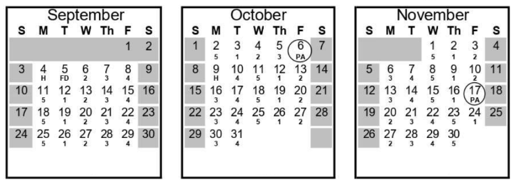

# tdsb-calendar
Utilities to manage calendars and schedules for TDSB (Toronto District School Board) students.

## TDSB_Calendar_Elementary.ipynb
An utility that marks up a list of dates in a school year with labels "Day 1", "Day 2", "Day 3", "Day 4", "Day 5" and shares it as iCalendar files.  

### Description of the TDSB calendar    
This labeling is a **consecutive day numbering system** employed by TDSB for elementary schools.  
It **cannot be derived** directly from **dates** or **days of week**.  

The calendar generating **algorithm** is as follows:  
- The TDSB day numbers start with "Day 1" on the 1st day of school and cycle through 1-5 until the end of a school year.  
- The numbers shift each time there is a holiday, a school break, or a PA day, so there's never a gap in the 1-5 sequence.  

Each day number has a schedule of activities associated to it. For example, library can be on Day 1, gym on Day 2, music on Day 3.  
Families might want to know what's on agenda today!  

### Ways to look up the calendar
TDSB **does not make** this numbering cycle widely **accessible** and **does not provide** the way to easily and quickly **look up** the day number.  
Individual schools or teachers can provide this info in a form of a locally prepared PDF with a calendar view of a year or an upcoming month. It can look like this:  

  

  

This option is mostly suitable for physical printing and pinning.  
It **cannot be integrated** into calendar apps.  

### Automated generation of the TDSB calendar
TDSB **provides** all **input data** on the calendar page at https://www.tdsb.on.ca/About-Us/School-Year-Calendar: days of school start and school end, lists of holidays, school breaks, and PA days.  
The sequence can be easily derived based on the input data.    

This utility uses the TDSB data as a source, **generates** the list of labeled calendar dates and **exports** it.  
When there's a **daily schedule** associated with each of the five days, the utility can **propagate** it to all days in a selected timeframe.    

### Export to calendar management applications  
The script generates .ics files which can be uploaded into calendars that support **iCalendar**, like Google Calendar.  

There will be three files: 
- a list of school days as whole-day events
- a list of non-school days (including holidays, school breaks, PA days) as whole-day events
- a list of daily activities as events with set start time and end time within a day

I recommend creating a separate calendar for each file:  
- It's easier to **toggle on or off** a calendar in a view so that the main calendar view doesn't become cluttered.
- It's easier to **update** the calendars. Just delete a calendar, create a new one with the same name, and re-import an updated .ics file.

**Important!** Create new dedicated calendars to import the .ics to, don't use existing ones. There are many events in these sequences, it would be extremely hard to delete them one-by-one from a non-dedicated calendar if needed. On the other hand, it's easy to delete a dedicated calendar and re-create it. 

The result in Google Calendar shows the three calendars toggled on:  

