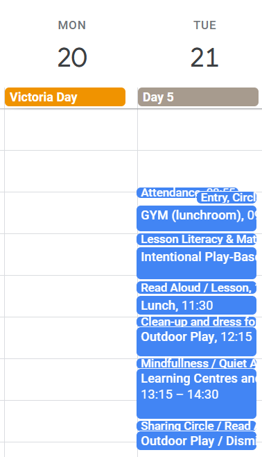

# tdsb-calendar
Utilities to manage calendars and schedules for TDSB students.

## TDSB_Calendar_Elementary.ipynb
An utility that marks up a list of dates in a school year with labels "Day 1", "Day 2", "Day 3", "Day 4", "Day 5". It's a fluid day numbering system in TDSB which cannot be derived from dates or days of week. The TDSB day numbers start on the 1st day of school and cycle through 1-5, but the number shift each time there is a holiday, a school break, or a PA day. Maybe they shift also due to some force majeure days, like snow days, but we had none so far in 2024, so I'm not sure how they're handled.   
If there's a daily schedule associated with each day, the utility can propagate it to all days in a selected timeframe.  
The script generates .ics files which can be uploaded into calendars like Google Calendar.  

